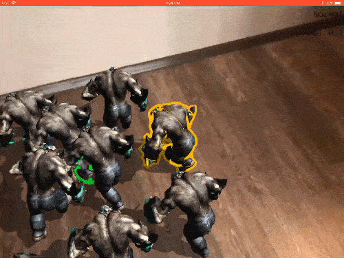

#  UrhoSharp

UrhoSharp is a lightweight Game Engine suitable for using with C# and
F# to create games and 3D applications. The game engine is available 
as a **portable class library**, allowing your game code to be written 
once and shared across all platforms. UrhoSharp is powered by [Urho3D](http://urho3d.github.io/),
a game engine that has been under development for more than a decade.
More information can be found in the [UrhoSharp
documentation](http://developer.xamarin.com/guides/cross-platform/urho/introduction/).
The bindings for Urho3D are licensed under the MIT license, as found
on the LICENSE file.

**Key advantages:**
- Lightweight - ~10mb per platform including basic assets
- Embeddable - can be embedded into any app as a subview (UIView, NSView, Panel, etc).
- Open-source - C# bindings and the underlying C++ engine Urho3D are licensed under the MIT License
- Powerfull 3rd parties: Bullet, Box2D, Recast/Detour, kNet, FreeType
- PBR, Skeletal animation, Inverse Kinematics

**Supported platforms:**
- Windows, WPF, WinForms
- iOS, tvOS
- macOS
- Android
- UWP
- AR: HoloLens, ARKit, ARCore
- Mixed Reality
- Xamarin.Forms (iOS, Android, UWP)

Samples
=======

Sample code lives in https://github.com/xamarin/urho-samples and
repository has them as a git submodule. Samples use UrhoSharp via nuget.

 



# Setup

* Available on NuGet: http://www.nuget.org/packages/UrhoSharp
* Install into your PCL project and Client projects.


Quick start
===========

To help developers get up and running quickly with UrhoSharp we are
providing a [solution
template](https://visualstudiogallery.msdn.microsoft.com/0851993e-16e9-417e-92f2-6bdb39308ed2)
for Visual Studio (you can find it in "Online templates" tab).  This
template consists of PCL+Android+iOS+Mac/Windows with a simple scene
and some assets (Xamarin Studio templates will be available soon):


How to build bindings
=====================

This is currently a little messy, so YMMV.

In order to compile binaries for all platforms you will need both
Windows and OS X environment.  Please follow these steps:

**1. Install:**

- XCode
- Visual Studio for Mac
- CMake (`brew install cmake`)
- Command Line tools (`xcode-select --install`)
- Android NDK + ANDROID_NDK_HOME environment variable

**2. Clone the repository including submodules**

```
git clone git@github.com:xamarin/urho.git --recursive
```

**3. Compile Urho.pch, SharpieBinder and generate bindigs**

The following command will download Clang 3.7.0 if you do not have it
installed, and use this to scan the Urho header files, then compile the sources
to PCH, parse it via SharpieBinder and generate C# bindings. Additionally 
there is a perl script to generate bindings to Urho3D events.

```
make Generated
```

**4. Compile UrhoSharp for Mac (fat dylib)**
```
make Mac
```
it takes 5-10 minutes.

**5. Compile UrhoSharp for iOS (fat dylib: i386, x86_64, armv7, arm64)**
```
make iOS SDK_VER=11.2
```

**6. Compile UrhoSharp for Android (armeabi, armeabi-v7a, arm64, x86, x86_64)** 
```
make -j5 Android
```
-j5 means a job per ABI. Make sure you have installed Android SDK and NDK (see MakeAndroid file)
This target can also be executed on Windows.

**7. Compile UrhoSharp for Windows (64 bit)**

Obviously you can't do it on OS X so you have to switch to Windows
environment. Make sure you have installed:

- Visual Studio 2017
- CMake 3.10
- GNU make (cygwin) - the easiest way to install it is to follow instructions to install mono:
   - Download Cygwin from www.cygwin.com (setup-x86-64.exe)
   - Run the following command in cmd.exe to install the required packages: 
`setup-x86_64.exe -P autoconf,automake,bison,gcc-core,gcc-g++,mingw64-i686-runtime,mingw64-i686-binutils,mingw64-i686-gcc-core,mingw64-i686-gcc-g++,mingw64-i686-pthreads,mingw64-i686-w32api,mingw64-x86_64-runtime,mingw64-x86_64-binutils,mingw64-x86_64-gcc-core,mingw64-x86_64-gcc-g++,mingw64-x86_64-pthreads,mingw64-x86_64-w32api,libtool,make,python,gettext-devel,gettext,intltool,libiconv,pkg-config,git,curl,wget,libxslt,bc,patch`

Execute:
```
make Windows
```
Then, open Urho.sln and compile `UrhoSharp.Windows` project in Release configuration.
By default, Urho on windows uses OpenGL, but you can also use DirectX11. In order order 
to use it, execute:
```
make Windows_D3D11
```
And compile `UrhoSharp.WindowsD3D' project.
All compiled binaries could be found in the Bin/{platform} folder.

**8. Compile UrhoSharp for UWP and HoloLens**

Execute:
```
make UWP
make SharpReality
```

And compile UrhoSharp.UWP and UrhoSharp.SharpRealitys projects in Release configuration.

Updating Documentation
======================

Once you have a build, run the `refresh-docs` target, like this:

```
make refresh-docs
```

This will update the documentation based on the API changes.  Then you
can use a tool like DocWriter [1] on the Mac to edit the contents, or
just edit the ECMA XML documentation by hand with an XML editor.

[1] http://github.com/xamarin/DocWriter
